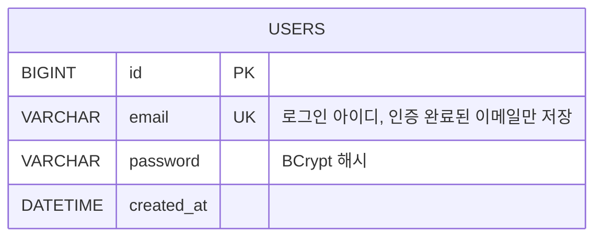
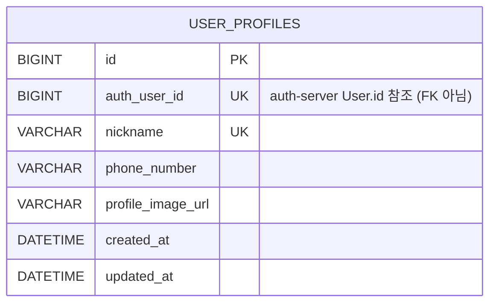

# MSA-Commerce 모듈 개요

이 문서는 `backend/` 하위의 모든 마이크로서비스 모듈을 총괄합니다. 각 모듈의 역할, 현재 구현 상태,
그리고 (엔티티가 정의된 경우) ERD를 정리합니다. 개별 모듈에 더 자세한 설계 문서가 있는 경우
`CLAUDE.md` 링크를 함께 표기합니다.

모듈이 늘어나거나 도메인 모델이 추가/변경될 때마다 이 문서도 함께 갱신합니다.

## 전체 구성

| 모듈 | 포트 | 게이트웨이 라우팅 | DB | 상태 | 문서 |
|---|---|---|---|---|---|
| `gateway` | 8080 | - | - | 라우팅만 구성됨 | - |
| `search-server` | 8083 | `/api/search/**` | Elasticsearch | `Product` 조회용 도큐먼트 + Kafka 이벤트 소비, DB 엔티티 없음 | - |
| `product-server` | 8085 | `/api/products/**` | MySQL (`productdb`) | 스켈레톤 (엔티티 미정의) | - |
| `order-server` | 8086 | `/api/orders/**` | MySQL (`orderdb`) | 스켈레톤 (엔티티 미정의) | - |
| `payment-server` | 8087 | `/api/payments/**` | MySQL (`paymentdb`) | 스켈레톤 + Spring Batch 예제 Job만 존재, 엔티티 미정의 | - |
| `auth-server` | 8088 | `/api/auth/**` | MySQL (`authdb`) + Redis | 이메일 인증 회원가입 구현 완료 | [`backend/auth-server/CLAUDE.md`](backend/auth-server/CLAUDE.md) |
| `user-server` | 8090 | `/api/users/**` | MySQL (`userdb`) | 프로필 CRUD 구현 완료 | [`backend/user-server/CLAUDE.md`](backend/user-server/CLAUDE.md) |
| `event-server` | 8089 | `/api/events/**` | MySQL (`eventdb`) + Redis + Kafka | 스켈레톤 (실시간 쿠폰 발급용, 엔티티 미정의) | - |

> "스켈레톤"으로 표기된 모듈은 `build.gradle.kts`/`Dockerfile`/`Application.kt`와 인프라 의존성만
> 준비되어 있고, 아직 JPA 엔티티나 비즈니스 로직이 작성되지 않은 상태입니다. 이런 모듈은 ERD가 없고
> 구현이 진행되면 이 문서에도 ERD 섹션을 추가합니다.

## `auth-server`

로그인 자격증명(이메일/비밀번호)을 관리하는 서버입니다. 아이디는 이메일이며, 이메일 인증을
통과해야만 회원가입이 완료됩니다. 자세한 API 플로우는 [`backend/auth-server/CLAUDE.md`](backend/auth-server/CLAUDE.md)
를 참고하세요.

### ERD

이메일 인증 진행 상태(코드 발송/인증 완료)는 DB 테이블이 아니라 Redis 키(`email-verification:{email}`,
`email-verified:{email}`)로만 TTL과 함께 임시 관리되므로 ERD에는 포함하지 않습니다.

## `user-server`

`auth-server`가 소유한 로그인 자격증명과는 분리된 사용자 프로필(닉네임, 연락처, 프로필 이미지 등)을
관리하는 서버입니다. `authUserId` 컬럼 값으로 `auth-server`의 `User.id`를 참조하지만, DB가 분리되어
있으므로 FK 제약은 걸지 않습니다. 자세한 API는 [`backend/user-server/CLAUDE.md`](backend/user-server/CLAUDE.md)
를 참고하세요.

### ERD

## `search-server`

상품 검색을 위한 Elasticsearch 조회 서버입니다. `product-server`가 발행하는 Kafka 이벤트
(`product-events`)를 소비해 Elasticsearch에 색인하는 구조를 목표로 하며, `Product`는 JPA 엔티티가
아닌 색인용 데이터 클래스입니다. 관계형 DB를 사용하지 않아 ERD가 없습니다.

## `product-server` / `order-server` / `payment-server` / `event-server`

각각 MySQL 데이터베이스(`productdb`, `orderdb`, `paymentdb`, `eventdb`)와 Redis/Kafka 의존성이
`docker-compose`에 준비되어 있지만, 아직 `Application.kt` 외의 도메인 엔티티가 작성되지 않았습니다
(`payment-server`는 Spring Batch 예제 Job만 존재). 도메인 모델이 확정되면 이 문서에 ERD 섹션을
추가합니다.

## `gateway`

Spring Cloud Gateway로 각 서버로의 경로를 라우팅합니다. 관계형 DB를 사용하지 않아 ERD가 없습니다.
